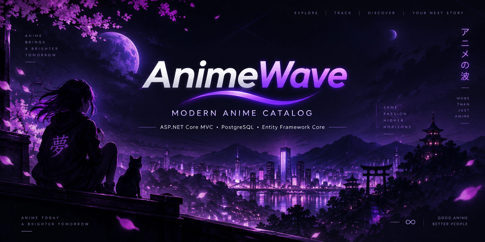

<p align="center">
  
</p>

<div align="center">

# 🌊 AnimeWave

### Modern Anime Catalog built with ASP.NET Core MVC

<p>
  
  
  
  
</p>

<p>
  
  
  
  
</p>

### Discover • Watch • Save

</div>

---

# 🌊 About AnimeWave

**AnimeWave** — учебное веб-приложение для просмотра, поиска и сохранения аниме, созданное на **ASP.NET Core MVC**.

Проект выполнен в современном тёмном стиле стриминговых сервисов и использует **PostgreSQL** для хранения данных, **Entity Framework Core** для работы с базой данных и **ASP.NET Core Identity** для авторизации пользователей.

Основная цель проекта — продемонстрировать создание полноценного MVC-приложения с авторизацией, ролями, CRUD-операциями, фильтрацией, динамическим поиском, профилем пользователя и современным пользовательским интерфейсом.

> Видеоконтент в проекте носит демонстрационный характер. Основной акцент сделан на архитектуре приложения, интерфейсе и работе с данными.

---

# ✨ Features

## 👤 User Features

- 🔐 Регистрация и авторизация
- 👤 Персональный профиль пользователя
- ❤️ Добавление аниме в избранное
- 🕘 История недавно просмотренных аниме
- 🔎 Умный поиск прямо из navbar
- ⌨️ Управление поиском с клавиатуры
- 🎭 Фильтрация по жанрам
- ⭐ Фильтрация по рейтингу
- 📅 Сортировка по году выхода
- 🔤 Поиск по русскому и оригинальному названию
- 🎬 Просмотр детальной информации об аниме
- 📱 Адаптивный интерфейс

---

## 🛠️ Admin Features

- ➕ Добавление нового аниме
- ✏️ Редактирование аниме
- 🗑️ Удаление аниме
- 🎭 Выбор нескольких жанров
- 🖼️ Добавление постера и баннера
- ⭐ Изменение рейтинга
- 📅 Изменение года выхода
- 🎬 Указание количества серий
- 🏷️ Управление статусом аниме
- 📊 Просмотр статистики каталога
- 🔒 Доступ только для роли `Admin`

---

## 🎨 UI / UX

- 🌑 Современный тёмный интерфейс
- 💜 Фиолетовые акценты
- 🎞️ Анимированная Hero-карусель
- ✨ Hover-анимации карточек
- 🌊 Плавное появление элементов
- 🔔 Toast-уведомления
- 💀 Skeleton Loading
- 🖼️ Live Preview при добавлении аниме
- 🔍 Popup Smart Search
- 📱 Responsive Design
- 🎯 Анимации кнопок и элементов интерфейса
- ⚡ Плавные переходы между состояниями

---

# 🔎 Smart Search

AnimeWave содержит динамический поиск без перезагрузки страницы.

Пользователь нажимает на иконку поиска в Navbar и начинает вводить название:

```text
Naruto
Death Note
Наруто
Solo Leveling
Attack on Titan
```

Поиск работает по:

- русскому названию;
- оригинальному названию;
- частичному совпадению;
- регистронезависимому поиску PostgreSQL `ILIKE`.

## ⌨️ Keyboard Shortcuts

```text
Ctrl + K    открыть / закрыть поиск
↑           предыдущий результат
↓           следующий результат
Enter       открыть выбранное аниме
Esc         закрыть поиск
```

## Как работает Smart Search

```text
Navbar Search
     │
     ▼
JavaScript Fetch
     │
     ▼
SearchController
     │
     ▼
Entity Framework Core
     │
     ▼
PostgreSQL
     │
     ▼
JSON Response
     │
     ▼
Dynamic Search Results
```

Поиск выводит:

```text
Poster
Title
Original Title
Rating
Release Year
Age Rating
```

---

# 👤 User Profile

Каждый авторизованный пользователь имеет собственную страницу профиля.

Профиль содержит:

```text
Avatar
Display Name
Email
Registration Date
Favorites Count
Viewed Anime Count
Recently Viewed Anime
```

При открытии страницы аниме оно автоматически добавляется в историю просмотров.

При повторном открытии одного и того же аниме новая запись не создаётся.

Вместо этого обновляется:

```text
ViewedAt
```

Поэтому последнее открытое аниме автоматически поднимается наверх списка.

---

# ❤️ Favorites

Авторизованные пользователи могут сохранять понравившиеся аниме в избранное.

Связь:

```text
ApplicationUser
      │
      ▼
   Favorite
      │
      ▼
    Anime
```

Для одного пользователя одно и то же аниме может быть добавлено в избранное только один раз.

После добавления или удаления появляются Toast-уведомления:

```text
✓ Аниме добавлено в избранное

✓ Аниме удалено из избранного
```

---

# 🎞️ Hero Carousel

Главная страница AnimeWave содержит анимированную Hero-карусель.

Каждый слайд отображает:

- Banner
- Title
- Original Title
- Rating
- Release Year
- Age Rating
- Episodes Count
- Genres
- Description

Карусель:

- автоматически переключается;
- поддерживает ручную навигацию;
- содержит плавные Fade-анимации;
- использует Zoom-анимацию баннера;
- имеет точки навигации;
- имеет индикатор текущего слайда;
- поддерживает Swipe на мобильных устройствах.

---

# 🛠️ Admin Panel

Администратор имеет отдельную панель управления каталогом.

Основные действия:

```text
Admin
 │
 ├── View Anime
 │
 ├── Create Anime
 │
 ├── Edit Anime
 │
 └── Delete Anime
```

Удаление выполняется через безопасный POST-запрос:

```text
POST
+
AntiForgeryToken
+
Admin Authorization
```

Админ-панель также показывает статистику:

```text
Total Anime
Completed Anime
Ongoing Anime
Average Rating
```

---

# 🔐 Authentication

AnimeWave использует:

```text
ASP.NET Core Identity
```

Identity отвечает за:

- регистрацию;
- авторизацию;
- хранение пользователей;
- Password Hash;
- Cookie Authentication;
- роли.

---

# 🛡️ Authorization

В проекте предусмотрены две основные роли:

```text
User
Admin
```

## User

Имеет доступ к:

```text
Home
Catalog
Anime Details
Smart Search
Favorites
Profile
Viewing History
```

## Admin

Имеет доступ ко всему пользовательскому функционалу и дополнительно:

```text
Admin Panel
Create Anime
Edit Anime
Delete Anime
```

Административный контроллер защищён:

```csharp
[Authorize(Roles = "Admin")]
```

---

# 🧰 Tech Stack

| Technology | Purpose |
|---|---|
| **C#** | Backend language |
| **ASP.NET Core MVC** | Web Framework |
| **Entity Framework Core** | ORM |
| **PostgreSQL** | Database |
| **Npgsql** | PostgreSQL Provider |
| **ASP.NET Core Identity** | Authentication & Roles |
| **Razor Views** | Server-side UI |
| **HTML5** | Markup |
| **CSS3** | Styling & Animations |
| **JavaScript** | Dynamic UI |
| **Fetch API** | Smart Search |
| **LINQ** | Database Queries |
| **Git** | Version Control |
| **GitHub** | Source Code Hosting |

---

# 🧱 Architecture

Проект построен по архитектуре MVC:

```text
┌─────────────────────────┐
│          Views          │
│   Razor / HTML / CSS    │
└────────────┬────────────┘
             │
             ▼
┌─────────────────────────┐
│      Controllers        │
│   Application Logic     │
└────────────┬────────────┘
             │
             ▼
┌─────────────────────────┐
│   Entity Framework      │
│          Core           │
└────────────┬────────────┘
             │
             ▼
┌─────────────────────────┐
│       PostgreSQL        │
│        Database         │
└─────────────────────────┘
```

---

# 📁 Project Structure

```text
AnimeWave/
│
├── Areas/
│   └── Admin/
│       ├── Controllers/
│       │   └── AnimeController.cs
│       │
│       └── Views/
│           └── Anime/
│
├── Controllers/
│   ├── AccountController.cs
│   ├── AnimeController.cs
│   ├── FavoritesController.cs
│   ├── HomeController.cs
│   ├── ProfileController.cs
│   └── SearchController.cs
│
├── Data/
│   ├── ApplicationDbContext.cs
│   └── DbInitializer.cs
│
├── Models/
│   ├── Anime.cs
│   ├── Genre.cs
│   ├── AnimeGenre.cs
│   ├── Episode.cs
│   ├── Favorite.cs
│   ├── ApplicationUser.cs
│   └── ViewingHistory.cs
│
├── ViewModels/
│   ├── AnimeFormViewModel.cs
│   ├── LoginViewModel.cs
│   ├── RegisterViewModel.cs
│   └── ProfileViewModel.cs
│
├── Views/
│   ├── Account/
│   ├── Anime/
│   ├── Favorites/
│   ├── Home/
│   ├── Profile/
│   │
│   └── Shared/
│       ├── _Layout.cshtml
│       └── _SmartSearch.cshtml
│
├── wwwroot/
│   ├── css/
│   │   └── site.css
│   │
│   └── images/
│       ├── posters/
│       ├── banners/
│       └── episodes/
│
├── Migrations/
│
├── Program.cs
├── appsettings.json
└── AnimeWave.csproj
```

---

# 🗄️ Database

AnimeWave использует PostgreSQL.

Основные таблицы:

```text
Animes
Genres
AnimeGenres
Favorites
ViewingHistories
AspNetUsers
AspNetRoles
AspNetUserRoles
Episodes
```

---

# 🔗 Database Relationships

Основные связи:

```text
ApplicationUser
      │
      ├──────── Favorite ────────── Anime
      │
      └──── ViewingHistory ─────── Anime


Anime
  │
  └──── AnimeGenre ─────────────── Genre
```

---

## 🎭 Anime ↔ Genre

Отношение:

```text
Many-to-Many
```

Реализовано через промежуточную таблицу:

```text
AnimeGenre
```

Схема:

```text
Anime
  │
  ▼
AnimeGenre
  │
  ▼
Genre
```

Одно аниме может иметь несколько жанров.

Один жанр может использоваться у нескольких аниме.

---

## ❤️ User ↔ Favorite

```text
ApplicationUser
      │
      ▼
   Favorite
      │
      ▼
    Anime
```

Уникальный индекс предотвращает повторное добавление одного аниме в избранное.

---

## 🕘 User ↔ ViewingHistory

```text
ApplicationUser
      │
      ▼
ViewingHistory
      │
      ▼
    Anime
```

История содержит:

```text
UserId
AnimeId
ViewedAt
```

---

# ⚙️ Installation

## 1. Clone Repository

```bash
git clone https://github.com/slanty62/AnimeWave
```

---

## 2. Open Project Directory

```bash
cd AnimeWave
```

---

## 3. Restore Packages

```bash
dotnet restore
```

---

# 🐘 PostgreSQL Setup

Создайте базу данных:

```text
AnimeWaveDb
```

Пример конфигурации:

```json
{
  "ConnectionStrings": {
    "DefaultConnection": "Host=localhost;Port=5432;Database=AnimeWaveDb;Username=postgres;Password=YOUR_PASSWORD"
  }
}
```

> ⚠️ Никогда не публикуйте настоящий пароль PostgreSQL в публичном репозитории.

---

# 🗃️ Entity Framework Migrations

Применить миграции через .NET CLI:

```bash
dotnet ef database update
```

Или через Visual Studio Package Manager Console:

```powershell
Update-Database
```

Создание новой миграции:

```powershell
Add-Migration MigrationName
```

---

# ▶️ Run Application

```bash
dotnet run
```

После запуска ASP.NET Core покажет адрес приложения:

```text
https://localhost:xxxx
```

---

# 🔒 Security

Перед публикацией проекта необходимо убедиться, что в GitHub отсутствуют:

```text
Database Passwords
Admin Passwords
API Keys
Access Tokens
Private Connection Strings
.env Files
User Secrets
```

Для локальной разработки рекомендуется использовать:

```bash
dotnet user-secrets
```

---

# 📦 .gitignore

В репозитории рекомендуется исключать:

```text
.vs/
bin/
obj/
Debug/
Release/
.env
appsettings.Development.json
*.user
*.suo
```

Пример:

```gitignore
.vs/
bin/
obj/

*.user
*.suo

.env
.env.*

appsettings.Development.json

Debug/
Release/

TestResults/

.DS_Store
Thumbs.db
```

---

# 🧪 What This Project Demonstrates

AnimeWave демонстрирует работу со следующими технологиями и концепциями:

- ASP.NET Core MVC
- MVC Architecture
- Dependency Injection
- Entity Framework Core
- PostgreSQL
- LINQ
- EF Core Migrations
- ASP.NET Core Identity
- Authentication
- Authorization
- Role-Based Authorization
- CRUD Operations
- Many-to-Many Relationships
- One-to-Many Relationships
- Razor Views
- ViewModels
- Fetch API
- AJAX-like Search
- JSON
- Responsive UI
- CSS Animations
- Client-side JavaScript
- Git
- GitHub

---

# 🔄 Git Workflow

Для обновления проекта рекомендуется использовать следующий порядок.

Сначала получить последние изменения:

```bash
git pull origin main
```

Посмотреть изменения:

```bash
git status
```

Добавить файлы:

```bash
git add .
```

Создать commit:

```bash
git commit -m "feat: describe changes"
```

Отправить изменения:

```bash
git push
```

---

# 📝 Commit Style

Примеры хороших commit messages:

```text
feat: add smart search
feat: add user profile
feat: add viewing history

fix: fix anime delete request
fix: fix favorites relationship

style: improve anime cards
style: redesign navbar

docs: update README
docs: add installation guide
```

Основные prefixes:

| Prefix | Meaning |
|---|---|
| `feat` | Новая функция |
| `fix` | Исправление |
| `style` | UI / CSS изменения |
| `docs` | Документация |
| `refactor` | Переработка кода |
| `chore` | Технические изменения |

---

# 🚀 Roadmap

Планируемые улучшения:

- [ ] ⭐ Пользовательские оценки
- [ ] 💬 Отзывы и комментарии
- [ ] 🧠 Система рекомендаций
- [ ] 🎯 Похожие аниме
- [ ] 👁️ Счётчик просмотров
- [ ] 📊 Расширенный Admin Dashboard
- [ ] ✏️ Редактирование профиля
- [ ] 🧹 Очистка истории просмотров
- [ ] 🔔 Расширенные уведомления
- [ ] 🎲 Случайное аниме
- [ ] 📈 Статистика просмотров
- [ ] 🐳 Docker
- [ ] 🐳 Docker Compose
- [ ] 🧪 Unit Tests
- [ ] 🧪 Integration Tests
- [ ] 🌐 Deployment

---

# 🎓 Project Purpose

AnimeWave разработан как учебный проект для изучения:

```text
ASP.NET Core MVC
C#
.NET
PostgreSQL
Entity Framework Core
Database Design
Web Development
Authentication
Authorization
Git
GitHub
```

Проект демонстрирует создание полноценного веб-приложения от структуры базы данных до пользовательского интерфейса.

---

# 💡 Main Concepts

Во время разработки проекта используются:

```text
MVC
Dependency Injection
Repository through DbContext
LINQ
Async / Await
Identity
Roles
CRUD
Database Relationships
ViewModels
Razor
JavaScript Fetch API
Responsive Design
```

---

# 🌐 Repository

Repository:

```text
https://github.com/slanty62/AnimeWave
```

Clone:

```bash
git clone https://github.com/slanty62/AnimeWave
```

---

# 👨‍💻 Author

<div align="center">

### slanty62

GitHub:

**https://github.com/slanty62**

</div>

---

# ⭐ Support

Если проект понравился:

- ⭐ поставьте Star;
- 🍴 сделайте Fork;
- 💡 предложите улучшение;
- 🐛 создайте Issue.

---

# 🏷️ Recommended GitHub Topics

Для репозитория рекомендуется использовать следующие Topics:

```text
aspnet-core
aspnet-mvc
csharp
dotnet
postgresql
entity-framework-core
ef-core
anime
mvc
razor
identity
javascript
web-development
responsive-design
course-project
```

---

# 📌 Recommended GitHub About Description

Для блока **About** на странице репозитория:

```text
🌊 Modern anime catalog built with ASP.NET Core MVC, PostgreSQL and Entity Framework Core.
```

---

# 📚 Project Status

```text
Status: In Development
Version: 1.0
Platform: ASP.NET Core MVC
Database: PostgreSQL
```

Проект продолжает развиваться и получать новые функции.

---

# 📄 License

Проект распространяется по лицензии:

```text
MIT License
```

Подробнее:

```text
LICENSE
```

---

<div align="center">

# 🌊 AnimeWave

### Discover • Watch • Save

**ASP.NET Core MVC • PostgreSQL • Entity Framework Core**

Built with ❤️ using C# and .NET

---

⭐ **Star the repository if you like AnimeWave!**

</div>
